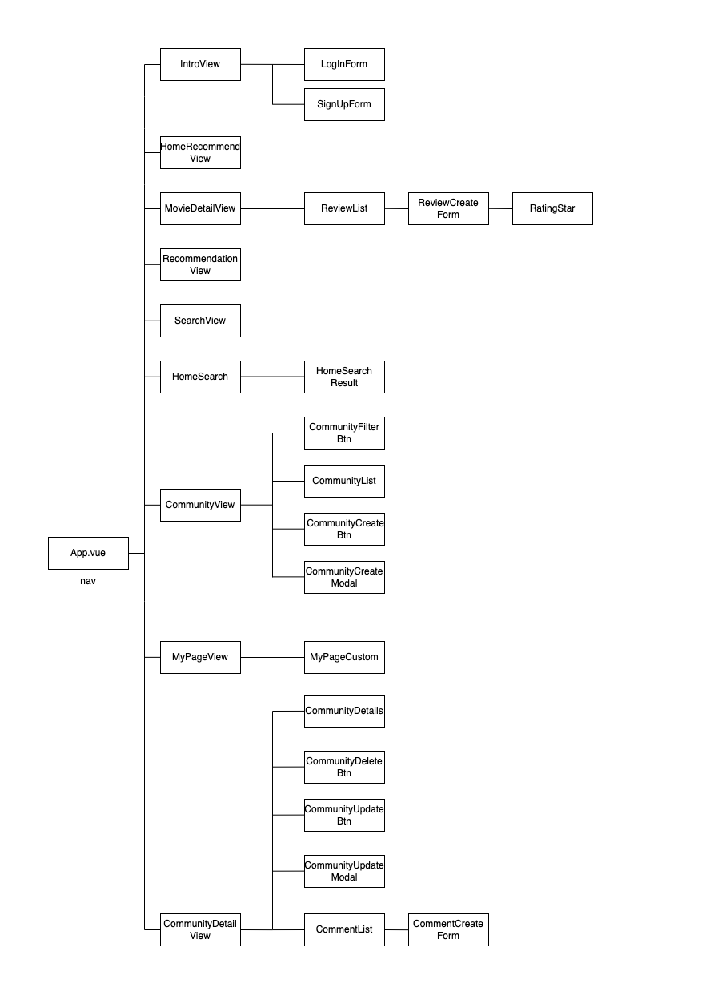

# Warp
This is the project about the movie recommendation website using Django & Vue.js.  

<br>
<br>
 
## MEMBERS 👩‍👧‍👧  
- [Hana Na](https://github.com/hana-nana)
- [Yejin Eum](https://github.com/yjeum)  
- [Chaeeun Lee](https://github.com/KRchaeeun)  

<br>
<br>
  
## HOW TO START  

1. Obtain a TMDB API key.
2. Create a .env file inside the final-pjt-back directory.
3. Write in the .env file in the following format. abe2123 and Aebd153 are examples.
```
TMDB_API_KEY="abe2123"
TMDB_ACCESS_TOKEN="Aebd153"
```
4. In final-pjt-front, press ctrl + shift + f to search for 'Your API Key', delete this part, and enter your TMDB API key.
5. Run the Django server:
```python
cd final-pjt-back  # Move into the final-pjt-back directory

python -m venv venv  # Create a virtual environment
source venv/script/activates  # Activate the virtual environment
pip install -r requirements.txt  # Install libraries

python manage.py makemigrations  # Create migrations
python manage.py migrate  # Migrate
python manage.py loaddata movies/fixtures/db_actors_directors_keywords.json
python manage.py loaddata movies/fixtures/db_genres_providers_videos.json
python manage.py loaddata movies/fixtures/db_movies.json

python manage.py runserver  # Run the server
```  
6. Run the Vue.js server:
```python
cd final-pjt-front  # Move into the final-pjt-front directory

npm install
npm install axios  # Install axios
npm install types.js  # Install typed.js

npm run dev  # Run the server
```

<br>
<br>
   
## OUR CODE COLLABORATION RULES 📑  
This is our code collaboration rules.
These rules are designed to establish a consistent, organized, and efficient approach to using Git, committing changes, and managing merges. They ensure that all team members contribute in a uniform manner. This consistency streamlines the code review process, reduces errors, and facilitates easier collaboration and understanding among developers.
 
<br>

 

 

<br>
 
### COMMIT: Commit Messages  
1. Purposefulness: Clearly convey the purpose and content of the changes.  
2. Format: Use the format [Type]: Description. For example, [FEAT]: Add user login functionality.  
3. Detailing: In the body of the message, explain in detail why the change was necessary or what problem it solves.  
 
<br>
 
### COMMIT: Commit Types  
1. FILE: Creation of folders and files.
2. INIT: Establishing the initial framework for a feature.
3. CREATE: Writing initial functionalities.
4. UPDATE: Adding new features.
5. FIX: Correcting bugs.
6. MERGE: Merging code branches.
7. TEST: Adding or modifying test code (e.g., console.log).
8. STYLE: Changes or additions to design.
9. DOCS: Documentation related changes (like README updates). 
 
<br>
 
### GIT: Branch Strategy  
1. main: Maintains stable, release-ready code.
2. dev: Holds code currently under development.
3. Feature-Specific Branches: For example, feature/login, feature/signup.
 
<br>
 
### MERGE: Regular Code Review and Merging  
1. Ensure to undergo a code review process and obtain team consensus before merging.  

<br>
<br>
 
## PREPARATION 💦

<br>

### Project Specification
This document defines the functional and non-functional requirements for the development of a movie recommendation website. The system offers services like recommending representative movies by year, hidden masterpieces, and includes a login system, user profile page, movie recommendation and detail pages, real-time popular movie services, and community features.
 
| Major Category            | Page                | Function                   | Detailed Function                                                                                                                                                                                                                                                                                                                                                                                                                                                                                              | Additional Feature                                                                                                                 |
|-------------------|-----------------------|------------------------|-------------------------------------------------------------------------------------------------------------------------------------------------------------------------------------------------------------------------------------------------------------------------------------------------------------------------------------------------------------------------------------------------------------------------------------------------------------------------------------------------------|--------------------------------------------------------------------------------------------------------------------------|
|Header & Footer    |                       |User/Admin Header| > Click on logo to go to main page (maintain recommended year)<br> > Click on recommendation to move to movie recommendation page<br> > Click on community to move to community page<br> > Provide search bar<br> > Add movie registration button for admin (only admin can register movies)<br> > Click on profile picture to toggle detailed content (My Page, Edit Profile, Logout)                                                                                                                           |                                                                                                                          |
|                   |                       |Basic Footer            | > Frequently Asked Questions<br> > Contact Email<br> > Team Name and GitHub Address (team repository and individual GitHub)<br>                                                                                                                           |                                                                                                                          |
| Login / User Management | Registration Page       | Sign Up               | > Enter ID, Password, Password Confirmation, Email, Name, Date of Birth<br> > Check for ID duplication<br> > Verify password and password confirmation match<br> > Move to login page after completing registration<br>                                                                                                                                                                                                                                                                                                                         | > Complex registration process                                                                                                        |
|                   | Login Page         | Login                 | > Enter ID, Password<br> > Display error message "Unable to find ID or password" if ID does not exist or if ID and password do not match<br> > Move to main page upon successful login<br>                                                                                                                                                                                                                                                                                                             |                                                                                                                          |
|                   | Find ID           | Retrieve ID            | > Enter Email<br> > Send ID reset link to email<br> > Move to login page after completing ID change<br>                                                                                                                                                                                                                                                                                                                                                                                             |                                                                                                                          |
|                   | Find Password         | Reset Password          | > Enter Email<br> > Send password reset link to email<br> > Move to login page after completing password change<br>                                                                                                                                                                                                                                                                                                                                                                                         |                                                                                                                          |
| My Page        | My Page List (Main) | Logout               | > Move to main page after logout<br>                                                                                                                                                                                                                                                                                                                                                                                                                                                                  |                                                                                                                          |
|                   |                       | 	Saved Movies       | > Display list of movies saved for later viewing (private)<br> > Display list of liked movies (public)<br> > Display list of reviews written by the user<br>                                                                                                                                                                                                                                                                                                                                                                                                            | > Pie chart of genres of liked movies                                                                              |
|                   |                       | Following, Followers       | > Display profile image<br> > Display brief self-introduction<br> > Display following count<br> > Display follower count<br> > Click on following or follower count to pop up list of following or followers<br>                                                                                                                                                                                                                                                                                                                                                                                                            | > Pie chart of genres of liked movies 
|                   |                       | Other User Profiles       | > Click on another user's ID to view their liked movies and written reviews<br>                                                                                                                                                                                                                                                                                                                                                                                                                                | > Rating feature like in Carrot Market? -> Identifies if the reviewer is reliable                                                                      |
|                   | My Page Edit       | Profile Image Upload     | > Click on profile picture to load a window for selecting an image file to upload<br> > Upload image upon file selection, display message "Profile image update completed" upon completion<br> > Update only this part<br>                                                                                                                                                                                                                                                                                               |                                                                                                                          |
|                   |                       | Edit User Information           | > Unable to change ID<br> > Can change name, email, mobile phone<br> > Update only this part<br>                                                                                                                                                                                                                                                                                                                                                                                                              |                                                                                                                          |
|                   |                       | Change Password          | > Allow information modification only if the existing password matches<br> > Verify password and password confirmation match<br> > Update only the password upon completion<br>                                                                                                                                                                                                                                                                                                                             |                                                                                                                          |
|                   |                       | Account Deletion              | > Process deletion only if the entered password before deletion matches<br> > Display confirmation message when clicking the delete button<br> > Move to logout and then to the main page after deletion<br>                                                                                                                                                                                                                                                                                                                                  |                                                                                                                          |
| Movie Recommendation          | Main Recommendation Page   | Periodical Movie Recommendations | > Select period (1960s to 2020s)<br> > First select decade, then detailed year<br> > Upon period selection, recommend 5 representative movies and 5 hidden masterpieces for that period, and provide a video of the top movie<br> > Genre selection feature<br> > Provide a function to check desired genres through a popup window, including a checkbox for selecting all genres<br> > Representative Movies<br> : List of top-rated movies for the selected year<br> : Consider weight of movies that did well in box office or received many awards<br> > Hidden Masterpieces<br> : Recommend movies with high ratings but low box office performance or screenings<br> : Discover hidden masterpieces based on user reviews and ratings<br>       |  > Adult content filter<br> > Add a 'Do Not Recommend' button<br> > Exclude 'Do Not Recommend' movies from the list and recommend the next in line<br> |
|                   | Movie Detail Page      | Main Movie Details | > Movie poster image, title, genre, detailed description, release year, runtime, average rating, movie video<br> > Write and display reviews under the movie video<br> > Provide a section for rating and writing content in the review writing window<br> > Save to 'Watch Later' and 'Like' button, save to respective databases<br> > Provide a list of reviews with author, content, and rating in recent order<br> > Click on review author to move to author's page                                                                                                                                                                                                                                                                | > Data analysis of ratings                                                                                                        |
|                   |                       | Review List            | > Rating, author, review title<br> > Show the latest 5 reviews<br> > Click on review author to move to author's profile<br>                                                                                                                                                                                                                                                                                                                                                                |                                                                                                                          |
|                   |                       | Write/Edit Rating & Review       | > Write on movie detail page<br> > Write rating and review<br> > For rating, use a colored star rating system<br>                                                                                                                                                                                                                                                                                                                                                                                                    | > Need to check if review and community features should be separated -> Yes, separate<br> -> Write reviews on movie detail page<br>                |
|                   |                       | Edit Review              | > Only the review author can edit<br> > Edit on movie detail page<br> > Update only this part<br> > Show the original review content during editing<br>                                                                                                                                                                                                                                                                                                                                        |                                                                                                                          |
|                   |                       | Delete Review              | > Only the review author and admin can delete<br> > Confirm deletion again<br> > Update only this part<br>                                                                                                                                                                                                                                                                                                                                                                                                               |                                                                                                                          |
| Search             |                      |                       | > Provide a list of movies containing the searched word in the title when a word is entered in the search bar<br> > Move to movie detail page upon clicking a movie<br>                                                                                                                                                                                                                                                                                                                                                                                                                                                 | > Display message "List of movies searched with 'keyword'"
| Community          | Main Community Page  | Post List          | > Display 20 posts<br> > Display list number + title + author + creation time + number of likes<br> > Provide two display methods (likes, most recent) in button format<br> > Post according to the number of likes<br> > Display posts in order of most recent creation                                                                                                                                                                                                                                                                                                                                                                                                                                                 | > Notice feature (only admin can write)<br>                                                    |
|                   |                       | Write Post            | > Only possible in logged-in state<br> Provide title, content, and a 'Write' button                                                                                                                                                                                                                                                                                                                                                                                                                                                                         |                                                                                                                          |
|                   | Community Detail Page  | Post Details            | > Display title, content, like button, comments, sub-comments list<br> > Only the post author can see edit, delete buttons<br> > Admin can also delete                                                                                                                                                                                                                                                                                                                                                                                                                                                                           |                                                                                                                          |
|                   |                     | Edit Post            | > Only the post author can edit                                                                                                                                                                                                                                                                                                                                                                                                                                                                           |                                                                                                                          |
|                   |                       | Delete Post            | > Only the post author and admin can delete                                                                                                                                                                                                                                                                                                                                                                                                                                                                            |                                                                                                                          |
|                   |                       | Comment List            |> Display only on the respective post page<br> > Display comment author and content<br> > Allow likes on comments<br> > Display the number of likes on comments<br>                                                                                                                                                                                                                                                                                                                                                                                                                         |                                                       |
|                   |                       | Sub-Comment List          | > Display under the parent comment<br> > Display sub-comment author and content<br>                                                                                                                                                                                                                                                                                                                                                                                                                      | > Allow likes on sub-comments<br> > Display the number of likes on sub-comments<br>                                                  |
|                   |                       | Write Comment              | > Only possible on the post detail page<br> > Only possible in logged-in state<br> > Update only this part<br>                                                                                                                                                                                                                                                                                                                                                                                                   |                                                                                                                          |
|                   |                       | Write Sub-Comment            | > Only possible under the parent comment on the post detail page<br> > Only possible in logged-in state<br> > Update only this part<br>                                                                                                                                                                                                                                                                                                                                                                                     |                                                                                                                          |
|                   |                       | Edit Comment              | > Only possible on the post detail page<br> > Only the comment author can edit<br> > Update only this part<br>                                                                                                                                                                                                                                                                                                                                                                                                         |                                                                                                                          |
|                   |                       | Edit Sub-Comment            | > Only possible under the parent comment on the post detail page<br> > Only the sub-comment author can edit<br> > Update only this part<br>                                                                                                                                                                                                                                                                                                                                                                                         |                                                                                                                          |
|                   |                       |  Comment Deletion              |  > Deletion only possible on the detailed post page<br> > Only the comment author and administrators can delete<br> > Updates only the relevant section<br> > When a comment is deleted, all its associated replies are also removed<br>                                                                                                                                                                                                                                                                                                                                              |                                                                                                                          |
|                   |                       | Reply Deletion            | > Deletion only possible under the parent comment on the detailed post page<br> > Only the reply author can delete<br> > Updates only the relevant section<br>                                                                                                                                                                                                                                                                                                                                                                                   |                                                                                                                          |
 
<br>
<br>
 
### ERD  
This document details the Entity-Relationship Diagram (ERD) designed for the movie recommendation website project. The ERD illustrates the system's database schema, showcasing how various entities such as users, movies, reviews, and community posts are interconnected.  

<br>


<br>
<br>
 
### API Design  
This document outlines the API design for the movie recommendation website. The API serves as the backbone for communication between the website's front-end and back-end, facilitating features like user authentication, movie information retrieval, reviews handling, and community interaction.

#### Authentication-Related APIs (Using 'accounts' app / dj-rest-auth) 
 
| Function                | Method     | Endpoint                                           | Description                                       |
|-------------------------|------------|----------------------------------------------------|---------------------------------------------------|
| User Registration       | POST       | `/api/v1/accounts/signup/`                         | Registers a new user.                             |
| User Login              | POST       | `/api/v1/accounts/login/`                          | Logs in a user.                                   |
| User Logout             | POST       | `/api/v1/accounts/logout/`                         | Logs out a user.                                  |
| User Follow/Unfollow    | GET, POST  | `/api/v1/accounts/user/{username}/follow/`         | Follows or unfollows a specific user.             |
| Following List          | GET        | `/api/v1/accounts/{username}/followingslist/`      | Retrieves the following list of a specific user.  |
| Follower List           | GET        | `/api/v1/accounts/{username}/followerslist/`       | Retrieves the followers list of a specific user.  |
| Movie Like/Unlike       | POST       | `/api/v1/accounts/movies/{movie_id}/like/`         | Toggles like status for a specific movie.         |
| Movie Likes List        | GET        | `/api/v1/accounts/users/{username}/likelist/`      | Retrieves the like list for specific movies.      |
| Movie Wishlist Add/Remove | POST     | `/api/v1/accounts/movies/{movie_id}/wishlist/`     | Toggles a specific movie's inclusion in the wishlist. |
| Movie Wishlist List     | GET        | `/api/v1/accounts/users/{username}/wishlistlist/`  | Retrieves the wishlist of movies for a user.      |
| My Page                 | GET        | `/api/v1/accounts/profile/{username}/`             | Retrieves the profile page of a user.             |
| Account Deletion        | POST       | `/api/v1/accounts/delete_account/`                 | Proceeds with the account deletion for a logged-in user. |
| Movie Recommendation Info | GET      | `/api/v1/accounts/like_wishlist_recommendations/{username}/` | Retrieves info for movie recommendations based on last liked and wishlisted movies. |
| Genre for Recommendation | GET       | `/api/v1/accounts/get_genre/`                      | Returns the most prevalent genre from wishlisted movies for recommendations. |
 
#### Movie/Movie Review APIs (Using 'movies' app)  
 
| Function                | Method     | Endpoint                                      | Description                                     |
|-------------------------|------------|-----------------------------------------------|-------------------------------------------------|
| All Movies List         | GET        | `/api/v1/movies/`                             | Retrieves a list of all movies.                 |
| Movie Details           | GET        | `/api/v1/movies/{movie_id}/`                  | Retrieves detailed information about a specific movie. |
| Specific Movie Reviews View/Add | GET, POST | `/api/v1/movies/{movie_id}/reviews/`       | Views or adds reviews for a specific movie.     |
| Specific Movie Review Edit/Delete | PUT, DELETE | `/api/v1/movies/reviews/{review_id}`    | Edits or deletes a specific review and rating.  |
| Masterpiece Movie Recommendation | GET   | `/api/v1/movies/recommend/`                  | Recommends movies based on selected year and genre, ranked by rating. |
| Hidden Gem Movie Recommendation | GET    | `/api/v1/movies/recommend_hidden/`           | Recommends high-rated but less known movies based on selected year and genre. |
| Recommended Movies List | GET        | `/api/v1/movies/list/<int:movie_id>`          | Retrieves a list of recommended movies.         |
 
#### Community-Related APIs (Using 'communities' app) 
 

| Function                | Method     | Endpoint                                      | Description                                     |
|-------------------------|------------|-----------------------------------------------|-------------------------------------------------|
| Posts List View/Add     | GET, POST  | `/api/v1/community/posts/`                    | Views or adds posts in the community section.   |
| Post View/Edit/Delete   | GET, PUT, DELETE | `/api/v1/community/posts/{post_id}/`       | Manages specific community posts.               |
| Post Like/Unlike        | POST       | `/api/v1/community/posts/{post_id}/like/`     | Adds or removes a like on a specific post.      |
| Comments/Replies View/Add | GET, POST | `/api/v1/community/posts/{post_id}/comments/` | Views or adds comments and replies to a post.   |
| Comment/Reply Edit/Delete | PUT, DELETE | `/api/v1/community/comments/{comment_id}/`  | Edits or deletes a comment or reply.            |
| Comment Like/Unlike     | POST       | `/api/v1/community/comments/{comment_id}/like/` | Adds or removes a like on a specific comment.   |
   
<br>
<br>
 
### VUE COMPONENTS  
This document provides an overview of the Vue components used in the movie recommendation website. Vue.js, a progressive JavaScript framework, is utilized to create interactive and dynamic user interfaces. The components are modular and reusable, enhancing the efficiency of the development process.
 
<br>


   
<br>
<br>
 
## ABOUT OUR PROJECT 👀

### Signup  
1. Display text using Typed.js.
2. Display feature descriptions and frequently asked questions.
3. Add movement on button hover.
4. Navigate to Login and Signup.
5. Do not display the navigation bar in the Intro window.  


<br>

### Account Deletion  
1. When proceeding with account deletion, delete the information from the database, log out, and then navigate to the INTRO PAGE.  

 
<br>
 
### Login & Logout  
1. Access the database using the username and password when logging in.  
2. Navigate to the INTRO PAGE upon logging out.  

 
<br>  
 
### Select Decade & Genre  
1. Set the decade.  
2. For the genre, enable both 'select all' and 'multiple selections'.  
3. Receive decade and genre data and navigate to the movie recommendation page.  
  

<br>

- This is the function of aggregating and displaying movie data:
```python
# Counting the number of movies per year
movies_per_year = (
    Movie.objects.annotate(year=ExtractYear("release_date"))
    .values("year")
    .annotate(count=Count("id"))
    .order_by("year")
)

for entry in movies_per_year:
    print(f"Year: {entry['year']}, Count: {entry['count']}")

# Counting the number of movies per year
# Aggregating the number of movies in increments of 10 years
movies_per_decade = (
    Movie.objects.annotate(decade=ExtractYear("release_date") / 10 * 10)
    .values("decade")
    .annotate(count=Count("id"))
    .order_by("decade")
)

for entry in movies_per_decade:
    print(f"Decade: {int(entry['decade'])}s, Count: {entry['count']}")
```
 
<br>  
 
### Provide a List of Recommended Movies  
1. Recommend movies based on the preference survey.  
2. Provide trailer videos for the recommended movies.  
3. Recommend 10 masterpieces and 10 hidden gems separately; masterpieces are recommended based on ratings, while hidden gems are high-rated but lesser-known movies.  

 
<br>

- This is the hidden movie recommendation function:
```python
# hidden movie recommendation function
def recommend_hidden_movies(request):
    # Retrieve a list of years (default is all years)
    years = request.GET.getlist("year")  # Receives multiple years as a list
    if not years:
        years = Movie.objects.dates("release_date", "year").values_list(
            "release_date__year", flat=True
        )

    expanded_years = []
    for year in years:
        if year.endswith("s"):
            for i in range(0, 10):
                expanded_years.append(f"{year[:-2]}{i}")
        else:
            expanded_years.append(year)

    # Retrieve a list of genres (default is all genres)
    genres = request.GET.getlist("genre")  # Receives multiple genres as a list
    print(expanded_years)
    if not genres:
        genres = Genre.objects.values_list("name", flat=True)

    # Extract the popularity values as a list
    popularity_values = list(Movie.objects.values_list("popularity", flat=True))

    # Use numpy to calculate the 50th percentile
    percentile_50 = np.percentile(popularity_values, 50)
    # Calculate the average value of the vote_average field
    average_vote = Movie.objects.aggregate(Avg("vote_average"))["vote_average__avg"]

    # Set the basic query
    query = Movie.objects.filter(
        release_date__year__in=expanded_years,  # Year filter
        popularity__lte=percentile_50,          # Less than or equal to 50th percentile in popularity
        vote_average__gte=average_vote,         # Greater than or equal to the average vote
    ).order_by("-vote_average")

    # Apply genre filter
    if genres:
        query = query.filter(genres__name__in=genres).distinct()

    recommended_movies = query[:10]

    serializer = MovieListSerializer(recommended_movies, many=True)
    return Response(serializer.data, status=status.HTTP_200_OK)
```

<br>

- This is the movie recommendation function:
``` python
# recommendation function
def recommend_movies(request):
    # Retrieve a list of years (default is all years)
    years = request.GET.getlist("year")  # Receives multiple years as a list
    if not years:
        years = Movie.objects.dates("release_date", "year").values_list(
            "release_date__year", flat=True
        )

    expanded_years = []
    for year in years:
        if year.endswith("s"):
            for i in range(0, 10):
                expanded_years.append(f"{year[:-2]}{i}")
        else:
            expanded_years.append(year)

    # Retrieve a list of genres (default is all genres)
    genres = request.GET.getlist("genre")  # Receives multiple genres as a list

    if not genres:
        genres = Genre.objects.values_list("name", flat=True)

    average_vote = Movie.objects.aggregate(Avg("vote_average"))["vote_average__avg"]

    # Set the basic query
    query = Movie.objects.filter(
        release_date__year__in=expanded_years,  # Year filter
        vote_average__gte=average_vote,         # Filter for movies with average vote greater than or equal to the average
    ).order_by("-popularity")

    # Apply genre filter
    if genres:
        query = query.filter(genres__name__in=genres).distinct()

    recommended_movies = query[:10]

    serializer = MovieListSerializer(recommended_movies, many=True)
    return Response(serializer.data, status=status.HTTP_200_OK)
```

<br>
 
### Movie Information, Similar Movie Recommendations, Reviews, Likes, WISHLIST Storage  
1. Provide movie information including posters, trailers, etc.  
2. Use the SIMILAR API to recommend movies similar to the current one.  
3. Enable writing movie reviews, saving likes, and WISHLIST.  

 
<br>
 
### Continuous Recommendations of Similar Movies
1. Clicking on a movie recommended as similar navigates to its detailed page.
2. Writing movie reviews is possible.  

 
<br>  
 
### Ability to Write Review Content and Star Ratings  
1. When writing a review, the star rating is filled in according to mouse movement.
2. For movie reviews, only one's own reviews can be edited or deleted.
3. When editing, the original data is displayed.  

 
<br>  
 
### Search  
1. Search is conducted through a modal window.
2. Entering a word in the search bar provides a list of movies containing that word in their title.
3. Clicking on a movie navigates to its detailed page.
4. When there are multiple movies, scrolling is possible within the modal.  

  
<br>

- This is the modal design for the search:
```js  
.modal {
  overflow-y: auto;
  max-height: 100%;
}

/* Elements for search on the home screen (not functional, only used for displaying the modal) */
#home-search {
  display: flex;
  justify-content: center;
  margin-bottom: 80px;
}

#home-search-box input {
  font-family: 'NanumSquareNeo-Variable';
  outline: none;
  border: none;
  border-bottom: white solid;
  background-color: #ffffff00;
  color: white;
}

#home-search-box input:hover {
  border-bottom: gray solid;
  transition: all 0.2s;
  transform: scale(1.03);
}

#home-search-box img {
  width: 35px;
  margin-right: 10px;
}

/* Elements inside the search modal */
#search-modal {
  z-index: 10;
  position: fixed;
  top: 0px;
  width: 100vw;
  height: 100vw;
}

#search-modal-search {
  z-index: 20;
  width: 100%;
  position: fixed;
  top: 30px;
  display: flex;
  align-items: center;
  flex-direction: column;
  flex-wrap: nowrap;
}

#search-modal-search-box {
  z-index: 30;
  margin-top: 50px;
}

#search-modal-search-box input {
  font-family: 'NanumSquareNeo-Variable';
  outline: none;
  border: none;
  border-bottom: white solid;
  background-color: #ffffff00;
  color: white;
}

#search-modal-search-box input:hover {
  transition: all 0.2s;
  transform: scale(1.03);
}

#search-modal-search-box img {
  width: 35px;
  margin-right: 10px;
}

#search-modal-result {
  width: 100%;
  max-width: 900px;
  z-index: 30;
}

/* Background animation */
#search-modal-bg {
  z-index: 10;
  position: fixed;
  top: 0px;
  width: 100%;
  height: 100%;
  background-color: #222222b0;
  backdrop-filter: blur(20px);
}

button {
  color: rgba(116, 116, 116, 0);
}
```

<br>

### Community Filtering  
1. Display the list number, title, author, time of creation, and the number of likes.
2. Provide two display formats (by likes, by recency) as buttons: Display posts in order of likes, Display posts in order of most recent creation.  

 
<br>

- This is the filtering function from Vue.js:
```js
// Currently selected sorting method
const currentSort = ref('latest')

// Computed property for sorting the list of posts
const sortedPosts = computed(() => {
  return posts.value.slice().sort((a, b) => {
    if (currentSort.value === 'latest') {
      // Sort by most recent date
      return new Date(b.created_at) - new Date(a.created_at)
    } else if (currentSort.value === 'likes') {
      // Sort by number of likes
      return b.likes_count - a.likes_count
    }
    return 0
  })
})
```  

<br>

### Community Posting 
1. Writing Community Posts.  

 
<br>
 
### Community Comments  
1. Write comments on community posts.
2. Ability to like posts.
3. View only the comments relevant to a specific post.
4. Only the author can edit or delete their comments.  

 
<br>  
 
### Follow & Follower  
1. Clicking on an author's name in the community redirects to that USER's PROFILE PAGE.
2. Ability to follow or unfollow if the user is not oneself.
3. Provides a list of followings and followers.
4. WISHLIST is not displayed if the user is not oneself.  


<br>
<br>
 
## BRAINSTORMING IDEAS 🧠  
This is the records of discussions/meetings during the project duration.  
  
[NotionURL]  
  
## Thoughts on the Project 🍻  
This is the section where individuals share their personal insights, experiences, and overall impressions gained from working on the project.
  
### Hana Na  


 
<br>
 
### Yejin Eum  
  

<br>
  
### Chaeeun Lee 


<br>
 